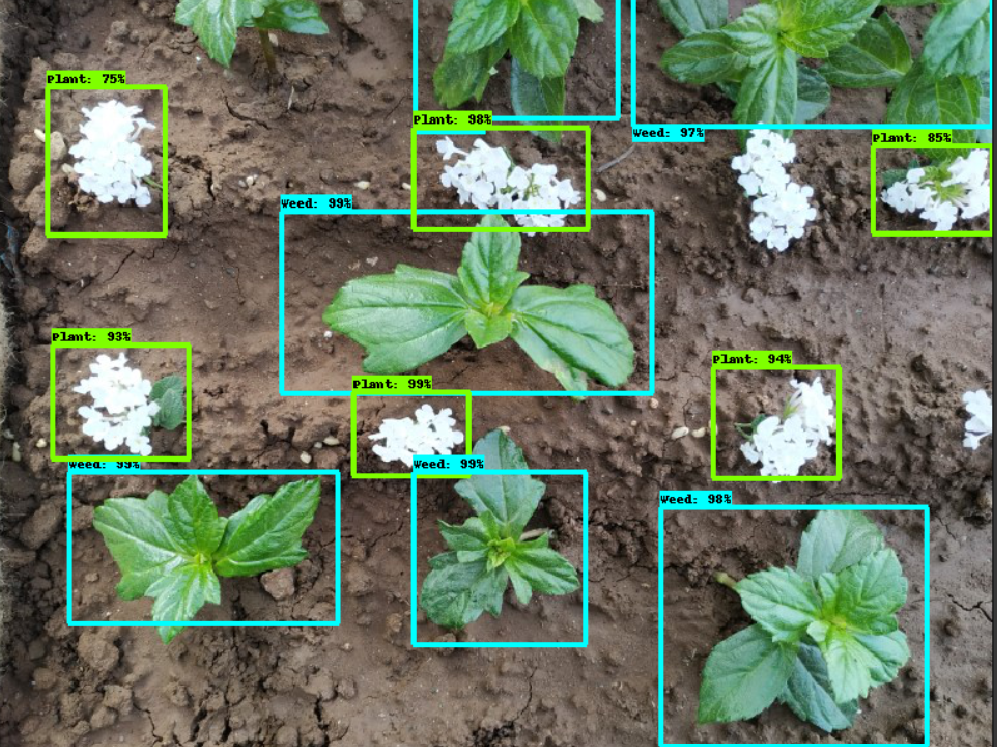
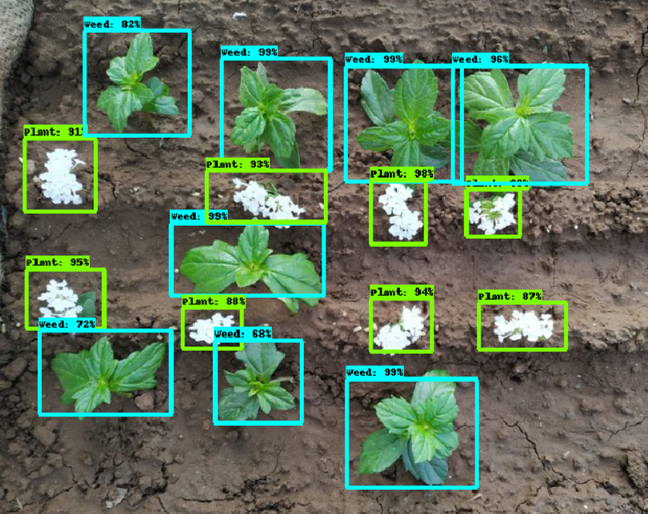
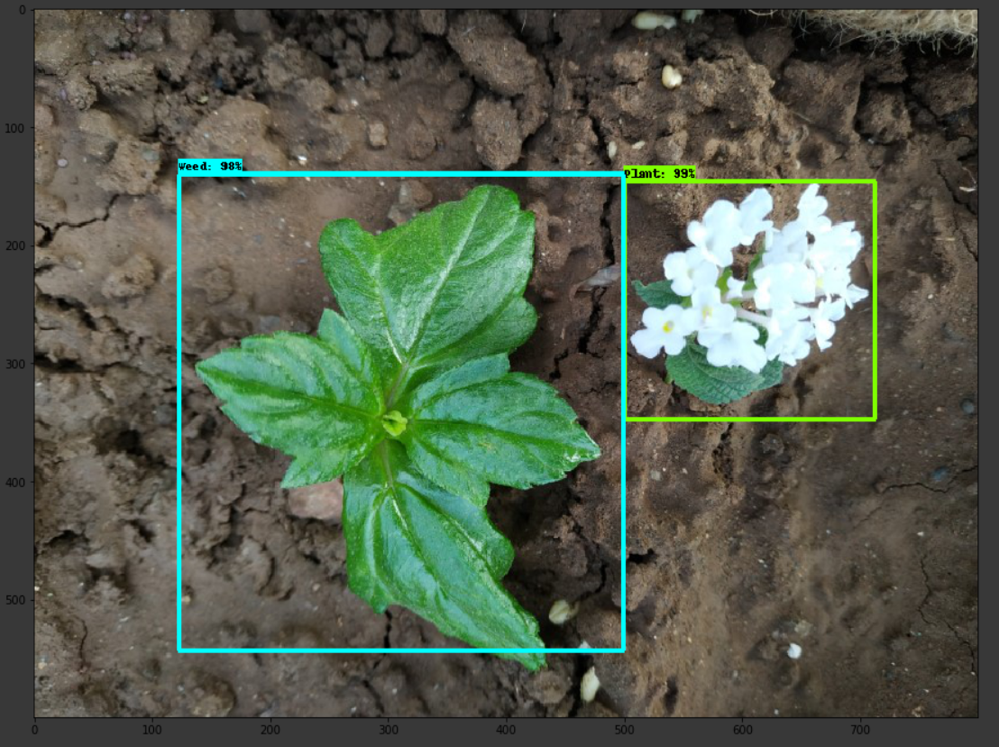

# Plant-vs-Weed
Object Detection Classifying Between Plant And Weed in the field. It is the Industrial Project. 

## Table of Contents - 
* [About Project](#about-project)
* [Detailed Explanation about Project](#detailed-explanation-about-project)
* [About Me](#about-me)

## About Project
This project aims for the detecting the weeds and plants. The project was the industrial project where main aim was to make the weed removal bot, where the bot was required to remove the unwanted weeds from the farm in the effiecient form with minimum cost. This part is about the computer vision where it would differenciate between the weed and the plant and give the coordinates where the weed is present. The Photos for the field was taken by the Rasberry Pi 4B+ camera and it is not taken from the internet for the processing purpose. After detecting the arm of the robot will remove the weed present in the field. 

**Important Note - Here flower is considered as the plant and leaves are considered as the weed for the trial and testing for working purpose of the project on non agricultural field. Otherwise code and purpose of the project is absolutely correct.**  

## Detailed Explanation about Project
I would be providing the detailed explanation of each and every line of code. 
This Project focuses on Classifying between Multiple Plants and Weeds Using Single Shot Multibox detector(SSD)

* First we would link the Google drive with the Google Colab as we are running the code on Google colab for faster processing due to usage of GPU. Also the version used here for tensorflow is 1.15.2

* Then will define the number of training steps - `1000` and number of the evaluation steps - `50`. Thr number of evaluation step is to check the model performance on non train data. Now we would define the model configuration, so I would be using `SSD Mobile Net V2 configuration` - SSD is single shot multibox detector. SSD is thr type of the object detection technique which has reached new records in terms of performance and precision for object detection tasks, scoring over 74% mAP (mean Average Precision) at 59 frames per second on standard datasets such as PascalVOC and COCO. Single Shot: this means that the tasks of object localization and classification are done in a single forward pass of the network. MultiBox: this is the name of a technique for bounding box regression. Detector: The network is an object detector that also classifies those detected objects. 
  ```
  'ssd_mobilenet_v2': {
        'model_name': 'ssd_mobilenet_v2_coco_2018_03_29',
        'pipeline_file': 'ssd_mobilenet_v2_coco.config',
        'batch_size': 12
  }
  ```
  
* Then I have taken `80:20` train vs test images. With this images, I have generated the XML files and then converted train folder annotation xml files to a single csv file. Same is done with test folder annotation xml files to a single csv file.
    ```
    !python xml_to_csv.py -i data/Images/train -o data/annotations/train_labels.csv -l data/annotations  ---> For Train Images
  	!python xml_to_csv.py -i data/Images/test -o data/annotations/test_labels.csv --------------------------> For Text Images
    ```

* Next is to generate the TFRecords for both train and text images csv files. The TFRecord format is a simple format for storing a sequence of binary records. For future using purpose we need to store up the train record name as train_record_name & test record name as the test_record_name.
    ```
    !python generate_tfrecord.py --csv_input=data/annotations/train_labels.csv --output_path=data/annotations/train.record --img_path=data/Images/train --label_map data/annotations/label_map.pbtxt
    !python generate_tfrecord.py --csv_input=data/annotations/test_labels.csv --output_path=data/annotations/test.record --img_path=data/Images/test --label_map data/annotations/label_map.pbtxt
    ```

* Now to download the Mobilenet SSD v2 Model and then we would be setting TensorFlow pretrained model checkpoint for better proecessing of the model
  ```
  fine_tune_checkpoint = os.path.join(DEST_DIR, "model.ckpt")
  fine_tune_checkpoint    
  ```

* Then we would be Configuring a Training Pipeline, so first we would be joining the pipeline file to already existing folder of `/content/models/research/object_detection/samples/configs/`, giving the name - `pipeline_fname` and then with use of `assert` we would be checking if `pipeline_fname` exist or not. The `assert` statement simply takes input a boolean condition, which when returns true doesn’t return anything, but if it is computed to be false, then it raises an AssertionError along with the optional message provided. So here the error message is printed using `.format()` in python. `str.format()` is one of the string formatting methods in Python3, which allows multiple substitutions and value formatting. This method lets us concatenate elements within a string through positional formatting. Its syntax is `Syntax : { } .format(value)` -> (value) : Can be an integer, floating point numeric constant, string, characters or even variables.
    ```
    import os
  	pipeline_fname = os.path.join('/content/models/research/object_detection/samples/configs/', pipeline_file)
    assert os.path.isfile(pipeline_fname), '`{}` not exist'.format(pipeline_fname)
    ```
    
* Now we need to define the `labelmap` - In a computer vision dataset, it is common to have annotations referring to class labels. Here for the different types of weeds and plants, the class labels include `colors, size`. In order to annotate an image, an image annotation file will often define the annotations specific to a particular image. In the case where the annotation file does not specify class labels, a label map is referenced to look up the class name. The label map is the separate source of record for class annotations. So first we import the label_map_util - the inbuilt function. Label maps map indices to category names, so that when our convolution network predicts `1`, we know that this corresponds to `Weed` and `0` if it is plant. So we convert the label map to categories and then we get the category index with the categories and at last we calculate the len of the category indexes as keys. 
    ```
    def get_num_classes(pbtxt_fname):
    from object_detection.utils import label_map_util
    label_map = label_map_util.load_labelmap(pbtxt_fname)
    categories = label_map_util.convert_label_map_to_categories(label_map, max_num_classes=90, use_display_name=True)
    category_index = label_map_util.create_category_index(categories)
    return len(category_index.keys())
    ```

* Now to start the training - We will do `model_dir = 'training/'` and if we want to remove the content if it is already present in the output directory i.e invlaid data then to use `!rm -rf {model_dir}`. Now we will make the directory - This means, `os.makedirs()` method in Python is used to create a directory recursively. That means while making leaf directory if any intermediate-level directory is missing, os.makedirs() method will create them all. It defines the `path` and `directory exist or not`. Its syntax is `Syntax: os.makedirs(path, exist_ok = False)` - Path: A path-like object representing a file system path. A path-like object is either a string or bytes object representing a path. exist_ok (optional) : A default value `False` is used for this parameter. If the target directory already exists, if its value is false then OSError is raised otherwise not. For value True, it leaves target directory unaltered.
    ```
    model_dir = 'training/'
    !rm -rf {model_dir}
    os.makedirs(model_dir, exist_ok=True)
    ```

* Coming to the main part of training the model. we define `pipeline_config_path`, `model_dir`, `number of training steps`, `number of Evaluation steps` and `logtostderr`. As name suggest `logtostderr` sends the logs to STDERR i.e standard error file. This means : Every command could send it's output to one of two places: a) it could be valid output or b) it could be an error message. It does the same with the errors as it does with the standard output; it sends them directly to your terminal screen if their are any. 
    ```
    !python /content/models/research/object_detection/model_main.py \
    --pipeline_config_path={pipeline_fname} \
    --model_dir={model_dir} \
    --alsologtostderr \
    --num_train_steps={num_steps} \
    --num_eval_steps={num_eval_steps}
    ```

* Then will use `!ls {model_dir}` to convert it to the list. `model_dir` is used to check for the trained model. 

* Now to do the work of Exporting a Trained Inference Graph. Once your training job is complete, you need to extract the newly trained inference graph, which will be later used to perform the object detection. So we define `input type` i.e `image tensor`, so Tensor(i.e. multidimensional array) is a natural representation for image and video. The resulted new research topic, called tensor image processing, offers new tools to exploit the multi-dimensional and intrinsic structures in image data. Another is `pipeline_config_path`, `output_directory` and `trained_checkpoint_prefix` where Checkpoints capture the exact value of all parameters used by a model. Checkpoints do not contain any description of the computation defined by the model and thus are typically only useful when source code that will use the saved parameter values is available.
    ```
    last_model_path = os.path.join(model_dir, last_model)
    print(last_model_path)
    !python /content/models/research/object_detection/export_inference_graph.py \
        --input_type=image_tensor \
        --pipeline_config_path={pipeline_fname} \
        --output_directory={output_directory} \
        --trained_checkpoint_prefix={last_model_path}
    ```
 
* When we defined Trained Inference Graph, we would be now joining the output directory along as with `frozen_inference_graph.pb` -> `frozen_inference_graph.pb`, is a frozen graph that cannot be trained anymore, it defines the graphdef and is actually a serialized graph. Also on output directory we would be abspath(output_directory), as `abspath(path)` returns a normalized absolutized version of the pathname path i.e output_directory. 
    ```
    import os
    pb_fname = os.path.join(os.path.abspath(output_directory), "frozen_inference_graph.pb")
    assert os.path.isfile(pb_fname), '`{}` not exist'.format(pb_fname) -----------------------> Explained in Above points :)
    ```

* Next is to do the Google Authentication as we are using Google colab for GPU purpose. This only needs to be done once in a notebook.
    ```
    # Install the PyDrive wrapper & import libraries.
    # This only needs to be done once in a notebook.
    !pip install -U -q PyDrive
    from pydrive.auth import GoogleAuth
    from pydrive.drive import GoogleDrive
    from google.colab import auth
    from oauth2client.client import GoogleCredentials

    # Authenticate and create the PyDrive client.
    # This only needs to be done once in a notebook.
    auth.authenticate_user()
    gauth = GoogleAuth()
    gauth.credentials = GoogleCredentials.get_application_default()
    drive = GoogleDrive(gauth)

    fname = os.path.basename(pb_fname)
    # Create & upload a text file.
    uploaded = drive.CreateFile({'title': fname})
    uploaded.SetContentFile(pb_fname)
    uploaded.Upload()
    
    from google.colab import files
    files.download(label_map_pbtxt_fname)
    
    files.download(pipeline_fname)
    ```

* We will first define the Path to frozen detection graph in `PATH_TO_CKPT` as this is the actual model that is used for the object detection. Then we would be setting the List of the strings that is used to add correct label for each box using `PATH_TO_LABELS = label_map_pbtxt_fname`. Now comes the main part of **Texting the code on the validation data**, so in this, just add images files to the `PATH_TO_TEST_IMAGES_DIR`. Then with use of `assert` we would be checking if `pb_fname` and `PATH_TO_LABELS` exist or not. Now with the help of `glob` module, I would be retriving files/pathnames matching a specified pattern. The pattern rules of glob follow standard Unix path expansion rules. It is also predicted that according to benchmarks it is faster than other methods to match pathnames in directories. With glob, we can also use wildcards ('.', ?) apart from exact string search to make path retrieval more simple and convenient. As in this case we are using '.' then its easy to retrive that Path. Finally, we would be checking if `TEST_IMAGE_PATHS` exist or not. If it exist then we would print that Path in the output, and if it does not exist then with the help of `.format()`, we would print that `No image found in PATH_TO_TEST_IMAGES_DIR`. Existing of the path is checked with the help that `len(TEST_IMAGE_PATHS) > 0` or not.
    ```
    import os
    import glob
    PATH_TO_CKPT = pb_fname
    PATH_TO_LABELS = label_map_pbtxt_fname
    PATH_TO_TEST_IMAGES_DIR =  os.path.join('/content/drive/My Drive/multiple rice detection/data/Images/', "test_ri")
    assert os.path.isfile(pb_fname)
    assert os.path.isfile(PATH_TO_LABELS)
    TEST_IMAGE_PATHS = glob.glob(os.path.join(PATH_TO_TEST_IMAGES_DIR, "*.*"))
    assert len(TEST_IMAGE_PATHS) > 0, 'No image found in `{}`.'.format(PATH_TO_TEST_IMAGES_DIR)
    print(TEST_IMAGE_PATHS)
    ```
    
* Now comes the part of detecting the object. First we would be importing the neccessary libraries. Then will do `sys.path.append("..")` as **notebook is stored in the object_detection folder.** So `sys.path` is a built-in variable within the `sys` module. It contains a list of directories that the interpreter will search in for the required module. As we are appending, So `append()` is a built-in function of sys module that can be used with path variable to add a specific path for interpreter to search. For displaying the image we would be using 3 below commands
    ```
    %matplotlib inline
    import matplotlib.pyplot as plt
    from PIL import Image
    ```

* Then will load `labelmap`, then in categories we would be converting the labelmap to categories and finally we would be creating the `category_index` (Explanation of all this terms is done above). Along with this we will **load a (frozen) Tensorflow model into memory**.
    ```
    label_map = label_map_util.load_labelmap(PATH_TO_LABELS)
    categories = label_map_util.convert_label_map_to_categories(label_map, max_num_classes=num_classes, use_display_name=True)
    category_index = label_map_util.create_category_index(categories)
    
    detection_graph = tf.Graph()
    with detection_graph.as_default():
    od_graph_def = tf.GraphDef()
    with tf.gfile.GFile(PATH_TO_CKPT, 'rb') as fid:
        serialized_graph = fid.read()
        od_graph_def.ParseFromString(serialized_graph)
        tf.import_graph_def(od_graph_def, name='')
    ```
    
* We would be loading the image in the form of the numpy array where we would be getting the `im_width` and `im_height` from image size and finally we would be returning the numpy array and would be reshaping to 3D array by taking `im_width`, `im_height` and `dimension` which means there would be dimension numbers of sub-arrays. Also we would be setting the Size, in inches for the output images. Here taking `IMAGE_SIZE = (20, 15)`. 
    ```
    def load_image_into_numpy_array(image):
    (im_width, im_height) = image.size
    return np.array(image.getdata()).reshape((im_height, im_width, 3)).astype(np.uint8)
    ```
    
 * Now we would be defining the 5 parameters - `'num_detections', 'detection_boxes', 'detection_scores', 'detection_classes', 'detection_masks'` for only the single image. Now to get the handle of input and output tensor, we will use `ops = tf.get_default_graph().get_operations()`. Then we would create the tensor dictionary which would contain `'num_detections', 'detection_boxes', 'detection_scores', 'detection_classes', 'detection_masks'` as the key value. Then will check for the condition of `'detection_masks' in tensor_dict`, we are going to process the `detection_boxes` and `detection_masks` for the single image. So here we are using `detection_boxes = tf.squeeze(tensor_dict['detection_boxes'], [0])`, This tf.squeeze means - Given a tensor input, this operation returns a tensor of the same type with all dimensions of size 1 removed. If you don't want to remove all size 1 dimensions, you can remove specific size 1 dimensions by specifying axis. So here we are removing size 1 dimension of 1st axis (0th index). Same goes for `detection_mask`. We would calculate `real_num_detection` by `tf.cast(tensor_dict['num_detections'][0], tf.int32)` in which the operation casts x (in case of Tensor) or x.values (in case of SparseTensor) to dtype (destination type). Next is : Reframe is required to translate mask from box coordinates to image coordinates and fit the image size, For this it is implemented using `detection_masks_reframed = utils_ops.reframe_box_masks_to_image_masks(detection_masks, detection_boxes, image.shape[0], image.shape[1])` And at last we would add back the batch dimension for originilty by using `tensor_dict['detection_masks'] = tf.expand_dims(detection_masks_reframed, 0)`. Finally we would be converting all the outputs i.e `'detection_boxes', 'detection_scores', 'detection_classes', 'detection_masks'` that are in float32 numpy arrays, into appropriate types as required and returning the `output_idict`
    ```
    def run_inference_for_single_image(image, graph):
    with graph.as_default():
        with tf.Session() as sess:
            # Get handles to input and output tensors
            ops = tf.get_default_graph().get_operations()
            all_tensor_names = {output.name for op in ops for output in op.outputs}
            tensor_dict = {}
            for key in [
                'num_detections', 'detection_boxes', 'detection_scores',
                'detection_classes', 'detection_masks'
            ]:
                tensor_name = key + ':0'
                if tensor_name in all_tensor_names:
                    tensor_dict[key] = tf.get_default_graph().get_tensor_by_name(tensor_name)
            if 'detection_masks' in tensor_dict:
                # The following processing is only for single image
                detection_boxes = tf.squeeze(tensor_dict['detection_boxes'], [0])
                detection_masks = tf.squeeze(tensor_dict['detection_masks'], [0])
                # Reframe is required to translate mask from box coordinates to image coordinates and fit the image size.
                real_num_detection = tf.cast(tensor_dict['num_detections'][0], tf.int32)
                detection_masks_reframed = utils_ops.reframe_box_masks_to_image_masks(detection_masks, detection_boxes, image.shape[0], image.shape[1])
                detection_masks_reframed = tf.cast(tf.greater(detection_masks_reframed, 0.9), tf.uint8)
                # Follow the convention by adding back the batch dimension
                tensor_dict['detection_masks'] = tf.expand_dims(detection_masks_reframed, 0)
            image_tensor = tf.get_default_graph().get_tensor_by_name('image_tensor:0')
            output_dict = sess.run(tensor_dict, feed_dict={image_tensor: np.expand_dims(image, 0)})

            # all outputs are float32 numpy arrays, so convert types as appropriate
            output_dict['num_detections'] = int(output_dict['num_detections'][0])
            output_dict['detection_classes'] = output_dict['detection_classes'][0].astype(np.uint8)
            output_dict['detection_boxes'] = output_dict['detection_boxes'][0]
            output_dict['detection_scores'] = output_dict['detection_scores'][0]
            if 'detection_masks' in output_dict:
                output_dict['detection_masks'] = output_dict['detection_masks'][0]
    return output_dict
    ```

* We would first open the image through `Image.open(image_path)`. Then we would be loading the image into numpy_array as the array based representation of the image will be used later in order to prepare the result image with boxes and labels on it. Then for actual detection we use the above function that I wrote - `run_inference_for_single_image`. And finally we visualize the boxes and labels on image array by different parameters i.e `detection_boxes, detection_classes, detection_scores` as the key. Finally ,we would be outputting the image with the `IMAGE_SIZE` that was decided earlier. 
    ```
    for image_path in TEST_IMAGE_PATHS:
    image = Image.open(image_path)
    # the array based representation of the image will be used later in order to prepare the
    # result image with boxes and labels on it.
    image_np = load_image_into_numpy_array(image)
    output_dict = run_inference_for_single_image(image_np, detection_graph) # Actual detection.
    # Visualization of the results of a detection.
    vis_util.visualize_boxes_and_labels_on_image_array(
        image_np,
        output_dict['detection_boxes'],
        output_dict['detection_classes'],
        output_dict['detection_scores'],
        category_index,
        instance_masks=output_dict.get('detection_masks'),
        use_normalized_coordinates=True,
        line_thickness=8)
    plt.figure(figsize=IMAGE_SIZE)
    plt.imshow(image_np)
    ```

Output Images - 

  
  
  

## About Me
**IF YOU LIKED MY WORK, PLEASE HIT THE STAR BUTTON, AND IF POSSIBLE DO PLEASE SHARE, SO THAT COMMUNITY CAN GET BENIFIT OUT OF IT BEACUSE I AM EXLPANING EACH AND EVERY LINE OF CODE FOR EACH AND EVERY PROJECT OF MINE.**

Also I am Solving **Algorithms and Data Structure Problems from more than 220 Days Without any off-Day and have solved more than 405 Questions on various topics and posting my solutions on Github Daily**. You can Visit my Profile of LeetCode here - **https://leetcode.com/Nisarg1406/**

I am good at Algorithms and Data structure and I have good Projects in Machine learning and Deep Learning (Computer Vision). **I am and would be posting the detialed explantion of each and every project working**. I am activily looking for an Internhip in **Software development enginering (SDE) Domain and Machine learning Domain**.

You can contact me on my mail ID - nisarg.mehta18@vit.edu OR nisargmehta2000@gmail.com and even Contact me on LinkedIn - https://www.linkedin.com/in/nisarg-mehta-4a378a185/
